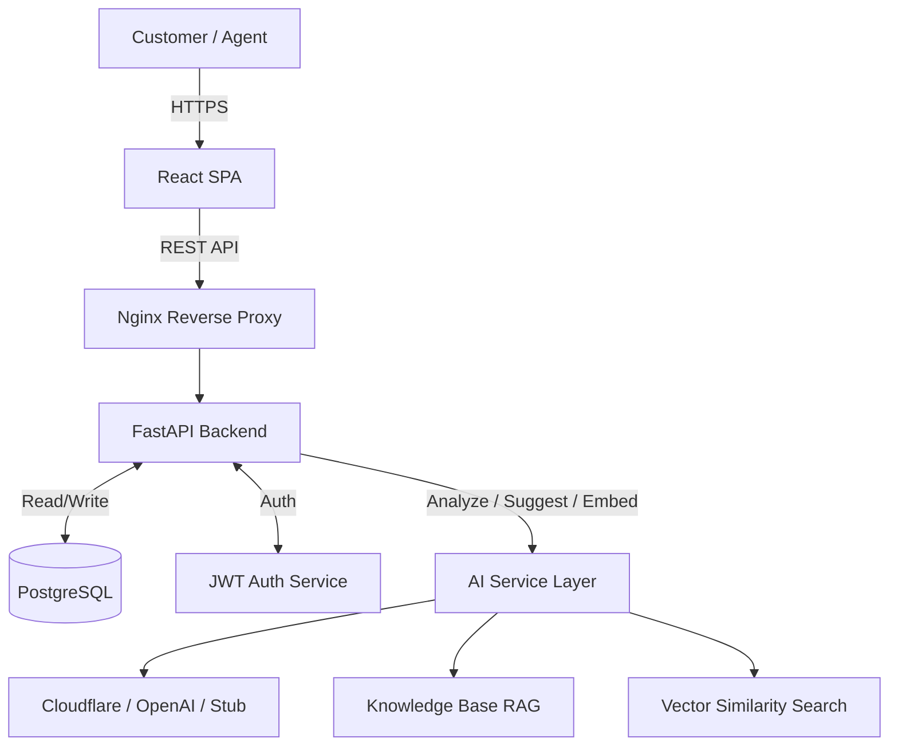

# SupportDesk — AI-Assisted Customer Support Ticket System


**SupportDesk** is a production-ready, full-stack customer support ticket management system designed around a core principle: **AI suggests, agents decide**. By integrating advanced NLP and AI capabilities directly into the support workflow, SupportDesk empowers agents to resolve tickets faster and more accurately without compromising human judgment.

---

## 🚀 Key Features

*   **Ticket Lifecycle State Machine**: Robust backend-enforced state transitions (`OPEN` → `IN_PROGRESS` → `WAITING` → `RESOLVED` → `CLOSED`) preventing illegal updates.
*   **AI Ticket Classification**: Automatic categorization of incoming tickets (category, priority, summary) with associated confidence scores.
*   **AI Suggested Responses**: Context-aware draft replies generated using current ticket context, internal support policies, and similar resolved tickets.
*   **Similar Ticket Retrieval**: Embedding-based cosine similarity search to surface relevant historical tickets.
*   **Agent Dashboard**: Real-time operational statistics, advanced filtering, and pagination.
*   **Multi-Provider AI Strategy**: Seamlessly switch between Cloudflare Workers AI (Llama 3.1), OpenAI-compatible endpoints, or a stub mode for offline/isolated testing.
*   **Evaluation Pipeline**: Built-in automated evaluation suite measuring accuracy, macro-F1, and per-category F1 on ~100 labeled tickets.
*   **Enterprise-Grade Security**: JWT-based authentication (PBKDF2-HMAC-SHA256), strict CORS configurations, security headers, and AI output guardrails.
*   **Email Integration**: Secure inbound email webhook handling with HMAC-SHA256 signature verification.

---

## 🏗 Architecture

SupportDesk follows a decoupled, service-oriented architecture optimized for scalable deployment.



---

## 💻 Tech Stack

### Backend
*   **Core**: Python, FastAPI, SQLAlchemy, Alembic
*   **Database**: PostgreSQL (Production) / SQLite (Dev/Test)
*   **AI & ML**: LangGraph, LangChain, LlamaIndex, sentence-transformers, scikit-learn
*   **Security**: JWT Auth (PBKDF2-HMAC-SHA256)

### Frontend
*   **Core**: React 18, TypeScript, Vite
*   **Routing**: React Router

### DevOps & Infrastructure
*   **Containerization**: Docker, Docker Compose
*   **CI/CD**: GitHub Actions
*   **Deployment**: Render (Backend & DB), Cloudflare Pages (Frontend)

---

## 🚦 Quick Start

### 1. Local Development
```bash
# Clone the repository
git clone https://github.com/imtarget05/AI-Customer-Support-Ticket-System.git
cd AI-Customer-Support-Ticket-System

# Start Backend
cd backend
pip install -r requirements.txt
export JWT_SECRET=$(python3 -c 'import secrets; print(secrets.token_hex(32))')
uvicorn app.main:app --reload

# Start Frontend (in a new terminal)
cd ../frontend
npm install
npm run dev
```

### 2. Docker Compose (Full Stack)
```bash
export JWT_SECRET=$(python3 -c 'import secrets; print(secrets.token_hex(32))')
docker compose up -d --build
```

---

## 📡 API Reference

The backend exposes a comprehensive RESTful API.

| Method | Endpoint | Description |
| :--- | :--- | :--- |
| `POST` | `/api/auth/login` | Authenticate user & get JWT |
| `POST` | `/api/auth/register` | Register new user account |
| `POST` | `/api/tickets` | Create a new support ticket |
| `GET` | `/api/tickets` | List tickets (with filters & pagination) |
| `GET` | `/api/tickets/{id}` | Retrieve ticket details |
| `PATCH` | `/api/tickets/{id}` | Update status/priority (Agent only) |
| `POST` | `/api/tickets/{id}/messages` | Add a message to a ticket |
| `POST` | `/api/tickets/{id}/ai/analyze` | Trigger AI classification |
| `POST` | `/api/tickets/{id}/ai/suggest` | Generate AI response draft |
| `GET` | `/api/tickets/{id}/similar` | Retrieve similar resolved tickets |
| `GET` | `/api/dashboard/stats` | Retrieve agent dashboard statistics |
| `GET` | `/api/health` | System health check |

---

## 📂 Project Structure

```text
├── backend/
│   ├── app/              # FastAPI application
│   │   ├── api/          # Route handlers
│   │   ├── models/       # SQLAlchemy ORM models
│   │   ├── schemas/      # Pydantic validation schemas
│   │   ├── services/     # Business logic (AI, tickets, auth)
│   │   ├── config.py     # Centralized configuration management
│   │   ├── security.py   # JWT + password hashing logic
│   │   └── seed.py       # Database seeding utility
│   ├── knowledge/        # Support policy documents for AI context
│   ├── tests/            # 21 test files (auth, AI, tickets, email, security)
│   ├── alembic/          # Database migrations
│   └── Dockerfile
├── frontend/
│   ├── src/              # React + TypeScript SPA source code
│   └── nginx.conf        # Production reverse proxy configuration
├── evaluation/
│   ├── tickets.json      # ~100 labeled evaluation tickets
│   ├── evaluate.py       # AI model evaluation pipeline
│   └── train_baseline.py # TF-IDF baseline classifier
├── docker-compose.yml    # Full-stack container orchestration
├── render.yaml           # Blueprint for Render cloud deployment
└── .github/workflows/    # CI/CD pipelines (Test & Deploy)
```

---

## 🧪 Testing & Evaluation

The project is heavily tested to ensure production reliability:

```bash
# Run backend tests (pytest)
cd backend && pytest tests/ -v

# Run frontend tests (Vitest)
cd frontend && npm test
```

### AI Evaluation Pipeline
A dedicated evaluation suite measures the AI classification performance against a baseline:
```bash
python evaluation/evaluate.py
```
*Evaluates model Accuracy, Macro-F1, and Per-Category F1 against ~100 ground-truth labeled tickets.*

---

## ☁️ Deployment

*   **Backend & Database**: Deployed on **Render** using Docker and managed PostgreSQL.
*   **Frontend**: Hosted globally via **Cloudflare Pages**.
*   **CI/CD**: Automated via **GitHub Actions** (`ci.yml`, `deploy.yml`) ensuring code is tested and built before deployment.

---

## 📄 License

This project is licensed under the MIT License.
