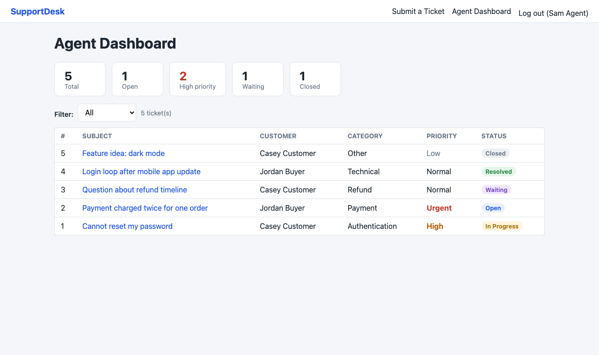
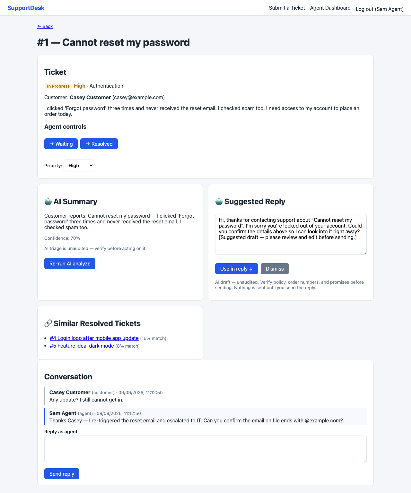

# SupportDesk — AI-Assisted Ticket Management

A full-stack support ticket system where AI **assists agents, never decides**: it triages, drafts, and retrieves — the agent always sends, resolves, and closes.

## Demo

| | |
|---|---|
|  |  |
| Agent dashboard (`/agent`) — stats, filters, AI triage | Ticket detail (`/tickets/:id`) — AI summary, suggested reply, similar tickets |

Customers file from `/`. More captures: [AI failure isolation](docs/screenshots/3-ai-failure-isolation.png) · [QA evidence](docs/screenshots/4-qa-evidence.png).

## What the AI does

- **Classifies** new tickets (category, priority, summary, confidence)
- **Finds similar** resolved tickets via embeddings + cosine similarity, with scores
- **Drafts a reply** grounded in the ticket, similar cases, and support policy
- **Logs every prediction** to `ai_predictions` for review and evaluation

Suggestion-only: nothing is sent, resolved, or closed by AI — the agent uses, edits, or dismisses each suggestion explicitly.

## AI reliability

The AI layer is treated as **untrusted**; output is schema-validated and guard-railed before reaching an agent:

- **Prompt steering** — tickets attempting to override the AI are refused
- **Refund commitments** — the AI can never promise refunds or compensation
- **Hallucinated policy** — no citing policies or FAQs it never saw
- **Fabricated order info** — no invented order or account claims
- **Provider failures** — timeout/5xx/429 retried once, then 502 with the ticket untouched

Fail closed: unsafe or invalid output is rejected, never shown; when AI is down the ticket stays fully usable. Details: [`docs/qa-followup-ai-guardrails.md`](docs/qa-followup-ai-guardrails.md).

## Two-way email

Agent replies can go out by email and customer replies reopen `WAITING`/`RESOLVED` tickets to `IN_PROGRESS`. Setup: [`docs/email-setup.md`](docs/email-setup.md).

## Stack

- **Backend** — FastAPI + SQLAlchemy (SQLite local, PostgreSQL via `DATABASE_URL`), JWT auth, pytest
- **AI** — pluggable via `AI_PROVIDER` (`stub` offline rule-based · `cloudflare` Workers AI Llama 3.1 · `openai` any /v1 endpoint); malformed output → 502, ticket untouched
- **Retrieval** — hashed bag-of-words embeddings + cosine similarity over resolved tickets; sentence-transformers via `AI_EMBED_PROVIDER=hf`
- **Frontend** — Vite + React 18 + TypeScript

## Run

```bash
# backend
cd backend
python3 -m venv .venv && source .venv/bin/activate
pip install -r requirements.txt
python -m app.seed                 # demo: agent@supportdesk.dev / agent1234 (agent), casey@example.com / customer1234 (customer)
uvicorn app.main:app --reload      # docs: http://localhost:8000/docs

# frontend (second terminal)
cd frontend
npm install && npm run dev         # http://localhost:5173 (proxies /api to :8000)
```

Credentials live in `backend/.env` (gitignored) — see `backend/.env.example`.

## Tests & Evaluation

```bash
cd backend && pytest               # 133 tests (1 skipped), no API key or external services
cd frontend && npm run build       # tsc strict + vite build
```

CI runs pytest + frontend build on push via `.github/workflows/ci.yml`.
Guardrail battery and failure-mode evidence: [`docs/qa-followup-ai-guardrails.md`](docs/qa-followup-ai-guardrails.md).

`evaluation/tickets.json` holds 92 labeled tickets; `evaluation/evaluate.py` reports accuracy, macro-F1, and per-category F1 (pure stdlib):

```bash
AI_PROVIDER=stub python evaluation/evaluate.py
```

| Provider | Accuracy | Macro-F1 |
|---|---|---|
| Rule-based stub (`AI_PROVIDER=stub`) | **93.5%** | **0.94** |
| TF-IDF + LogReg (this repo) | **1.0** | **1.0** |
| DistilBERT fine-tune | deferred | deferred |
| Llama 3.1 8B (via Cloudflare) | **79.3%** | **0.78** |

Honest note: on this narrow 5-way taxonomy the rule-based stub beats the 8B LLM (confusions cluster on refund↔payment); TF-IDF's 1.0 is dataset-specific (73/92 train, 19/92 val, artifact gitignored) and DistilBERT is deferred — 92 labels are insufficient for a stable fine-tune.

## Docs

- [Product spec](docs/spec.md) · [Model comparison](docs/model-comparison.md) · [Email setup](docs/email-setup.md) · [Recruiter snapshot](docs/recruiter-snapshot.md)
