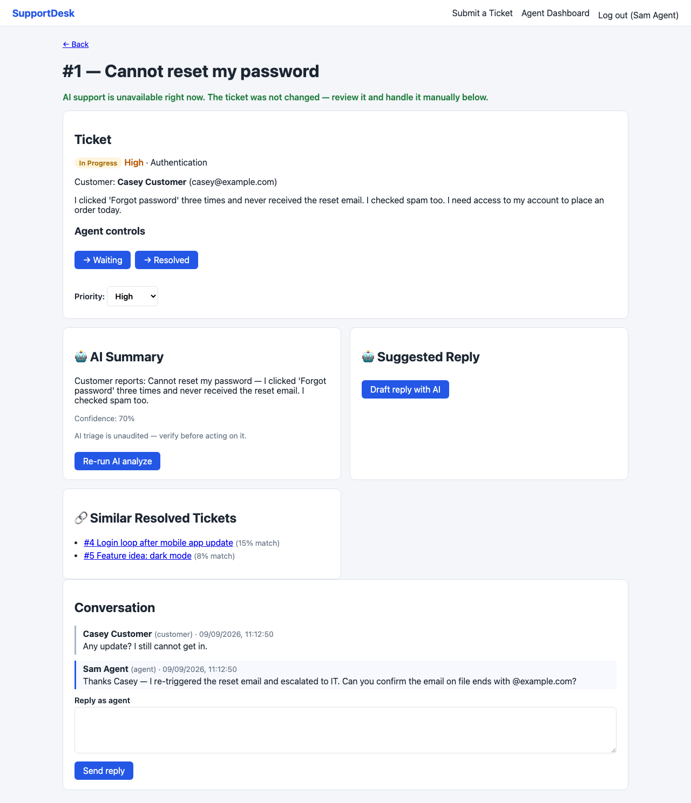
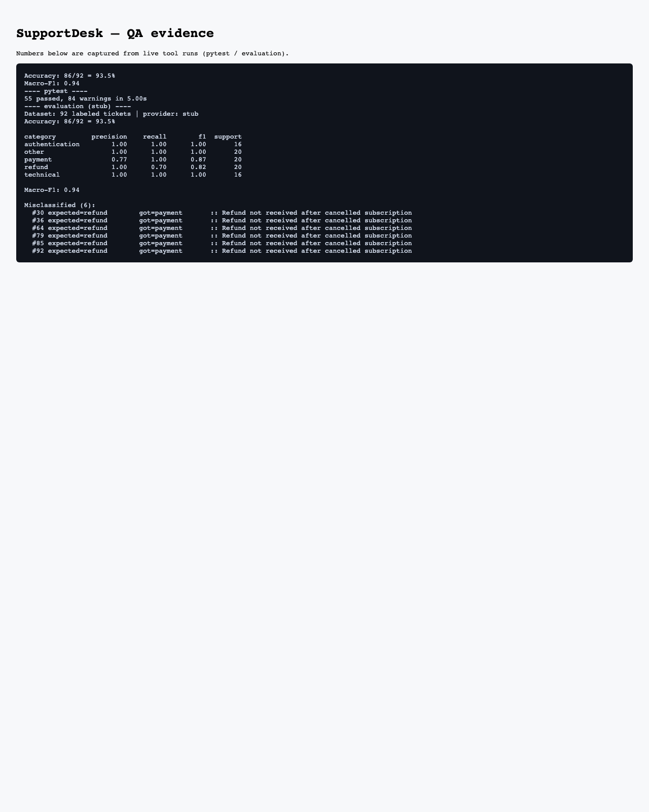

# SupportDesk — AI-Assisted Ticket Management

A full-stack support ticket system with AI-assisted classification, similar-ticket
retrieval, and response drafting, with human review and failure-isolated AI
integration.

SupportDesk is a support ticket system where AI **assists agents, never decides**:
auto triage (category / priority / summary / confidence), suggested replies, and
similar resolved tickets. The agent always sends, resolves, and closes — the AI
suggests, the human decides.

## Screenshots

| | |
|---|---|
|  |  |
|  |  |

- **Agent dashboard** — ticket list with AI triage (category & priority) and status
- **Ticket detail** — AI summary with confidence, similar resolved tickets, and a
  suggested reply the agent reviews, edits, and sends
- **AI failure isolation** — when the AI provider fails, the UI explains it and the
  ticket stays fully usable
- **QA evidence** — test and evaluation output captured from live runs

(Direct links: [`docs/spec.md`](docs/spec.md) · [`docs/qa-followup-ai-guardrails.md`](docs/qa-followup-ai-guardrails.md))

## What the AI does

1. **Classifies** incoming support tickets (category, priority, summary, confidence)
2. **Finds similar** resolved tickets via embedding + cosine similarity
3. **Generates a response draft** for the agent to review
4. **Requires human review** before anything is sent

## AI Reliability

The AI layer is treated as **untrusted**. Its raw output is validated and
guard-railed before it can reach an agent, and we test it adversarially:

- **Prompt steering** — a ticket that tries to override the AI is refused
- **Refund commitments** — the AI can never promise refunds/compensation
- **Hallucinated policy** — the AI can't cite policies/FAQs it never saw
- **Fabricated order info** — no invented order/account claims
- **Provider failures** — timeout/5xx/429 retried once; recurring failures return
  502 and leave the ticket untouched

Unsafe or invalid AI output is **rejected rather than shown to agents**. When AI is
down, the ticket still works and is handled manually (fail closed on AI, no loss
of the business operation).

Human in the loop is enforced end-to-end: the agent edits/approves any AI draft
before it exists as a thread message, and every classification is logged to
`ai_predictions` for review and evaluation.

| Provider | Accuracy | Macro-F1 |
|---|---|---|
| Rule-based stub (`AI_PROVIDER=stub`) | **93.5%** | **0.94** |
| TF-IDF + LogReg (this repo) | **1.0** | **1.0** | *trained on 73/92 train, evaluated on 19/92 val; artifact gitignored* |
| DistilBERT (fine-tuned) | *pending* | *pending* | *3-epoch CPU fine-tune; artifact gitignored* |

An honest result: on this narrow 5-way taxonomy the rule-based baseline beats
the 8B LLM (Llama 3.1 8B via Cloudflare: 79.3% / 0.78, whose confusions cluster
on refund↔payment and authentication↔technical), and the report says so honestly.
Measuring both providers against the same labels is the point — the classifier
is evaluated, not assumed to work.

## Quality process

AI features were tested adversarially, not just on happy paths. The workflow:

```
discover → baseline → test design → execute →
  adversarial (steering, refund, hallucination) →
    evidence → bug triage → fix → regression → verdict
```

The AI guardrail + reliability fixes (refund-commit drafts, hallucinated
grounding, steerable triage, confidence over-reporting, missing timeout/retry)
were driven by a manual test battery, fixed with end-to-end regression, and
documented in `docs/qa-followup-ai-guardrails.md`. **89 pytest cases** cover
auth, authorization, ticket lifecycle (state machine), CRUD, boundaries,
AI behavior and guardrail failure modes — no API key or external service needed.

## Screens

- `/` — customer ticket form (with account, or anonymous with email)
- `/agent` — agent dashboard: stats cards, ticket list with status filters
- `/tickets/:id` — ticket detail: lifecycle controls, AI summary, suggested reply
  (use/edit/dismiss), similar resolved tickets, conversation thread

## Stack

- **Backend**: FastAPI + SQLAlchemy (SQLite local, PostgreSQL via `DATABASE_URL`), JWT auth (PBKDF2), pytest.
- **AI**: three pluggable providers via `AI_PROVIDER` — `stub` (offline rule-based, no key), `cloudflare` (Workers AI, Llama 3.1), `openai` (any /v1 endpoint). LLM output is schema-validated; malformed output → 502 and ticket data is left untouched. Credentials live in `backend/.env` (gitignored) — see `backend/.env.example`.
- **Retrieval**: hashed bag-of-words embeddings + cosine similarity over
  resolved/closed tickets ("light RAG" reference, not a chatbot). Lazy-loaded
  sentence-transformers available via `AI_EMBED_PROVIDER=hf`.
- **Frontend**: Vite + React 18 + TypeScript.

## Run

```bash
# backend
cd backend
python3 -m venv .venv && source .venv/bin/activate
pip install -r requirements.txt
python -m app.seed                 # demo: agent@supportdesk.dev / agent1234
uvicorn app.main:app --reload      # docs: http://localhost:8000/docs

# frontend (second terminal)
cd frontend
npm install && npm run dev         # http://localhost:5173 (proxies /api to :8000)
```

## Tests

```bash
cd backend && pytest               # 89 tests, no API key / external services
cd frontend && npm run build       # tsc strict + vite build
```

## Evaluation

`evaluation/tickets.json` holds 92 labeled tickets; `evaluation/evaluate.py`
reports accuracy, macro-F1 and per-category F1 (pure stdlib):

```bash
python evaluation/evaluate.py            # uses AI_PROVIDER from backend/.env
```

| Provider | Accuracy | Macro-F1 |
|---|---|---|
| Rule-based stub (`AI_PROVIDER=stub`) | **93.5%** | **0.94** |
| TF-IDF + LogReg (this repo) | **1.0** | **1.0** | *trained on 73/92 train, evaluated on 19/92 val; artifact gitignored* |
| DistilBERT (fine-tuned) | *pending* | *pending* | *3-epoch CPU fine-tune; artifact gitignored* |

An honest result: on this narrow 5-way taxonomy the rule-based baseline beats
the 8B LLM, whose confusions cluster on refund↔payment and authentication↔technical.
Measuring both providers against the same labels is the point — the classifier
is evaluated, not assumed to work.

